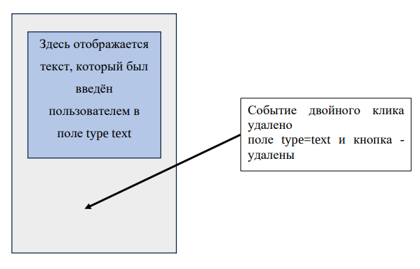

#  Веб-программирование

## 6-й семестр

### Содержание:
 - [**Практика 1 (20.02.2024)**](#практика-1)
 - [**Практика 2 (20.02.2024)**](#практика-2)
 - [**Практика 3-4 (05.05.2024)**](#практика-3-4)

### Практика 1:

#### Задание 1: <a href="https://github.com/Breez97/WebProjects/tree/main/6-th%20Module/Practice_1">Код</a>

Создать выпадающее модальное окно с сообщением «Введите число»,
результат сохранить в переменную. Далее создать второе аналогичное окно,
результат сохраняется в переменную.
Далее необходимо вывести результат в виде строки 2 способами:

`alert(Результат суммы a={подставить число} и b={подставить число}
=> {подставить число a} + {подставить число b} = {a+b})`

Аналогичный ответ вывести в консоль браузера через `console.log()`.

---

### Практика 2:

#### Задание 1: <a href="https://github.com/Breez97/WebProjects/tree/main/6-th%20Module/Practice_2/Task_1">Код</a>

На странице создать `div` элемент, внутри которого добавлены элементы:
`h1` и `div(с id=elem2)`. Также на странице (за пределами div элемента),
добавлены: поле формы для ввода текста и кнопка.

Написать `JavaScript код`, который при нажатии на кнопку, вызывает
функцию, которая считывает значение из текстового поля и добавляет его в
`div` элемент с `id=elem2`.
После добавления текста в `div` элемент, поле формы очищается.


#### Задание 2: <a href="https://github.com/Breez97/WebProjects/tree/main/6-th%20Module/Practice_2/Task_2">Код</a>

Создать на странице несколько `div` элементов. Поместить в них различный текст.

С помощью `JavaScript кода` собрать весь текст из элементов `div` в массив и вывести через `console.log()`.

#### Домашнее задание: <a href="https://github.com/Breez97/WebProjects/tree/main/6-th%20Module/Hometasks/Hometask_Practice_1_2">Код</a>

Есть несколько `div` элементов (3 штуки), каждый из которых содержит текст с тегом `p`.
Под `div` расположена кнопка `input type="color"`.

Добавить 2 события на каждый элемент `div`:

- при наведении курсора на элемент (`mouseover`), его цвет (`background-color`) становится тем цветом, который сейчас выбран в `input type="color"`
- когда курсор уходит с элемента (`mouseout`), его цвет становится красным

Изначально `div` элементы не имеют заливки (белого цвета).

---

### Практика 3-4:

#### Задание 1: <a href="https://github.com/Breez97/WebProjects/tree/main/6-th%20Module/Practice_3_4/Task_1">Код</a>

На странице необходимо реализовать 3 `div` элемента, в каждый из них
добавить: `div` элемент (пустой), поле для ввода текста и кнопку. Минимальная
настройка `css` стилей: ширина, высота, отступы – внушение и внутренние, цвет
фона.

Поле для ввода текста и кнопка на момент загрузки страницы скрыты.

Необходимо реализовать следующий функционал:

- При двойном клике по элементу `div` (родительскому – первому
элементу), в блоке отображается ранее скрытое поле для ввода текста и кнопка
добавить.

- При клике на кнопку добавить, текст из поля для ввода текста
переносится в дочерний элемент `div` (второй). Поле для ввода текста и кнопка
удаляют. Событие двойного клика удаляется с родительского элемента.

- Назначать обработчик событие только через метод `addEventListener`.
Назначать обработчик событие только через метод `addEventListener`.
Необходимо реализовать одну функцию (обработчик), которая будет работать
для всех карточек.




#### Задание 2: <a href="https://github.com/Breez97/WebProjects/tree/main/6-th%20Module/Practice_3_4/Task_2">Код</a>

Необходимо реализовать 4 `JS` объекта, которые будут хранить
информацию про товары. Структура объекта:
```
Obj = {
	title: 'название товара',
	desc: 'описание товара',
	price: 'цена',
	status: true||false, // статус товара, в наличие/отсутствует
}
```

На странице представлены 4 пустые карточки для товаров

Первому объекту соответствует первая карточка, второму – вторая, третьему – третья, четвертому – четвертая.

Необходимо связать карточку (шаблон `html`) и объект хранящий в себе информацию про товар.

Каждая карточка содержит в себе элементы `div` для указания в них следующей информации: названия товара, описание, цена + статус наличия товара, кнопка – заполнить информацию. Минимальная настройка `css` стилей: ширина, высота, отступы – внушение и внутренние, цвет фона.

На кнопку `«Заполнить информацию»`, добавлено событие одного клика, которое при нажатии на элемент обращается к объекту, который относится к конкретной карточке товара и потягивает из неё всю информацию про товар. Вместо значения: `true`, `false` – необходимо указать строковое значение: есть в наличии / отсутствует.

После того как данные подставляются в карточку, кнопка становится неактивна и с неё удаляется обработчик события при клике.

Назначать обработчик событие только через метод `addEventListener`. Необходимо реализовать одну функцию (обработчик), которая будет работать для всех карточек.


---

### Практика 5-6:

#### Задание 1: <a href="https://github.com/Breez97/WebProjects/tree/main/6-th%20Module/Practice_5_6/Task_1">Код</a>

На странице расположено 4 `div` элемента.

Необходимо реализовать следующий функционал:

- На каждый из блоков `div` добавить событие `click`, используя библиотеку `JQuery`.
- При нажатии кнопкой на какой-либо из блоков `div` он меняет свой цвет на красный. Реализовать это с помощью метода `css()`.
- Также при нажатии блок `div` увеличивается в ширину.

#### Задание 2: <a href="https://github.com/Breez97/WebProjects/tree/main/6-th%20Module/Practice_5_6/Task_2">Код</a>

Реализовать `таблицу размером 3x3 блока`, в каждой из ячеек которой записаны `нули`.

На каждой из ячеек реализовать событие `click`. Когда пользователь нажимает на какую-либо из ячеек, значение в ней увеличивается на единицу.

Также необходимо добавить перед таблицей (или после таблицы) блок `div`, внутри которого будет выводится следующее сообщение:

```
Пользователь нажал на ячейку под номером <номер ячейки>
```

Новые сообщения должны добавляться в блок, а не перезаписываться (предусмотреть расстягивание блока `div`).

Номер ячейки изначально задать через параметр `data-*`.

**Дополнительное задание:**

Добавить на страницу кнопку `Добавить строку`, при нажатии на которую в таблице будет создаваться дополнительная строка.

#### Задание 3: <a href="https://github.com/Breez97/WebProjects/tree/main/6-th%20Module/Practice_5_6/Task_3">Код</a>
На странице есть элемент `div`.

Под ним необходимо добавить следующее меню:
- Блок `select`, внутри которого будут варианты выбора: `пустое поле`, `h1`, `h2`, `p`, `h1`, `div`.
- В случае, если в блоке `select` выбрано НЕ `пустое поле`:
	- На странице появляется `input type='text'` (просто отображается, изначально создан на странице), внутрь которого пользователь вводит строку. Справа от этого блока нужно добавить две картинки: галочку (в случае, если поле `input` НЕ пустое) и крестик (в случае, если поле `input` пустое).
	- На странице появляется `input type='radio'` (просто отображается, изначально создан на странице) с вариантом выбора, куда добавить новую строку:
		1. В блок `div`
		2. За пределами блока `div`
	- На странице отображается неактивная кнопка `добавить`, если в поле `input type='text'` что-то появляется, то кнопка становится активной для нажатия.
- После нажатия на кнопку `добавить` соответствующая запись из `input type='text'` записывается внутрь или снаружи блока `div` в зависимости от выбора, а также с необходимым тэгом.